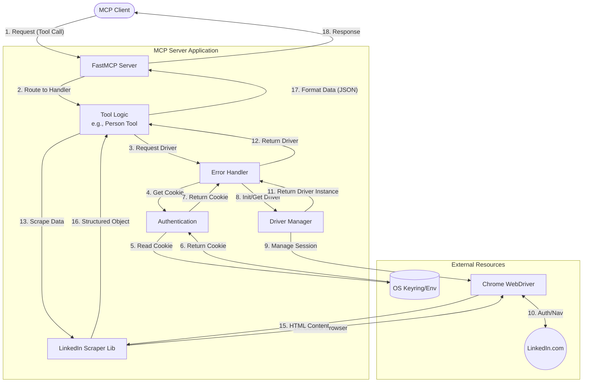
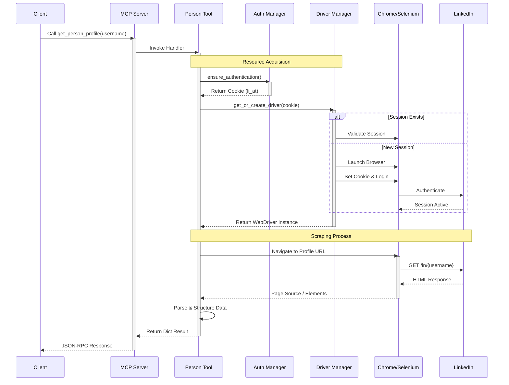

# System Architecture

## Overview

The **LinkedIn MCP Server** is a Model Context Protocol (MCP) server that acts as a bridge between AI assistants (like Claude) and LinkedIn. It allows AI agents to retrieve structured data from LinkedIn profiles, companies, and job postings by automating a real browser session.

## Components

- **Client**: The MCP client (e.g., Claude Desktop, generic MCP client).
- **MCP Server (`server.py`)**: Uses `FastMCP` to expose tools and handle JSON-RPC communication.
- **Tool Logic (`tools/`)**: Implements the specific capabilities (Person, Company, Job).
- **Driver Manager (`drivers/chrome.py`)**: Manages the lifecycle of the Chrome WebDriver (Selenium), handling initialization, persistence, and cleanup.
- **Authentication (`authentication.py`)**: Manages the retrieval and storage of LinkedIn session cookies, integrating with the OS keyring and environment variables.
- **Configuration (`config/`)**: Centralized configuration management.
- **LinkedIn Scraper**: External library (`linkedin_scraper`) used to parse the raw HTML.

## Data Flow Diagram

The following diagram illustrates how data flows through the system when a tool is executed.

## Sequence Diagram

This sequence diagram details the interaction order for a typical `get_person_profile` call.

## Component Details

### 1. Server (`server.py`)
Initializes the `FastMCP` instance and registers all available tools (`register_person_tools`, `register_company_tools`, etc.). It serves as the entry point for the MCP protocol.

### 2. Tools (`tools/*.py`)
Contains the business logic for each capability.
- **`person.py`**: Handles profile scraping.
- **`company.py`**: Handles company page scraping.
- **`job.py`**: Handles job search and details.
These modules are responsible for transforming raw objects from the scraper into JSON-serializable dictionaries expected by the MCP client.

### 3. Driver Manager (`drivers/chrome.py`)
A singleton-like manager that maintains the Selenium WebDriver instance. It handles:
- **Lazy Initialization**: Browser is only launched when needed.
- **Persistence**: Reuses the same browser session for multiple requests to avoid repeated logins.
- **Authentication**: Applies the `li_at` cookie to the browser session.
- **Cleanup**: Closes the browser when the server shuts down.

### 4. Authentication (`authentication.py`)
Abstracts the source of the session cookie. It prioritizes sources in this order:
1.  Environment Variables / CLI Args (`LINKEDIN_COOKIE`)
2.  OS Keyring (stored from previous interactive logins)

### 5. Error Handling (`error_handler.py`)
Provides a centralized way to catch exceptions (like `CaptchaRequired`, `InvalidCredentials`) and convert them into user-friendly text messages that the LLM can understand and relay to the user.
